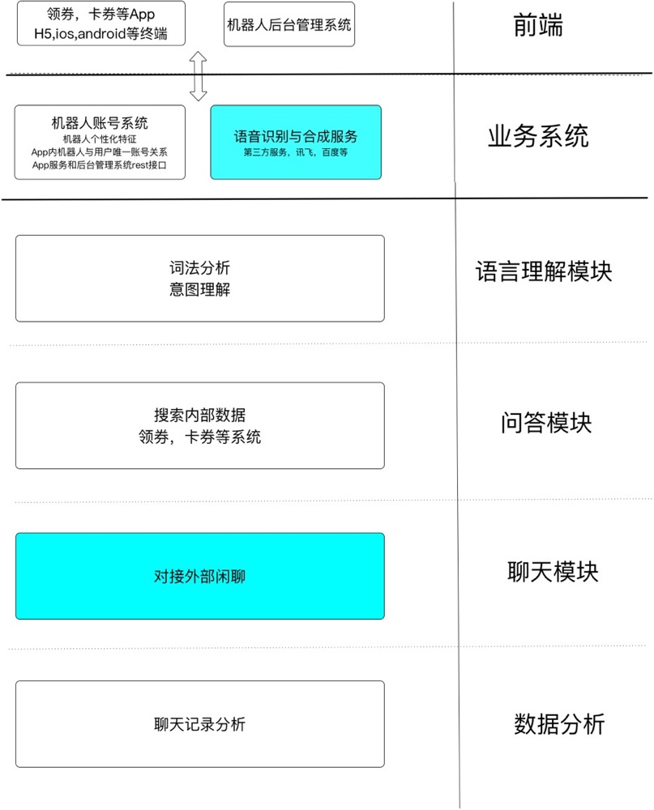
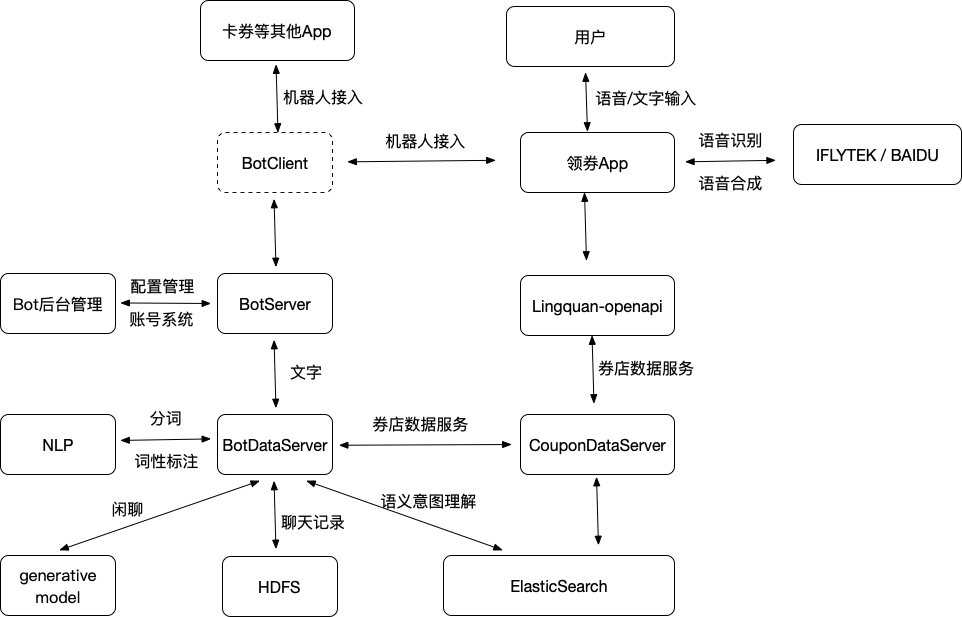

<!--[美好生活从领券开始 by 庙街/爱客仕](https://appadvice.com/app/e9-a2-86-e5-88-b8/1249324960)-->

# "App Get Coupons" Robot Assistant

聊天机器人（chatbot），也被称为会话代理，现已成为了一个热门话题。微软在聊天机器人上押上了重注，Facebook（M）、苹果（Siri）、谷歌 和 Slack 等公司也是如此。 新一波创业者们正在尝试改变消费者与服务的交互方式。

## Chatbot

- [Chatbot Research 1 - 聊天机器人的行业综述][b1]

- [Chatbot Research 2 - NLP 的基础知识回顾][b2]

- [Chatbot Research 3 - 机器学习构建 chatbot][b3]

Chatbot Research More Info 请点击

- [Chatbot Research 4 - 深度学习知识回顾][b4]

- [Chatbot Research 5 - 基于深度学习的检索聊天机器人][b5]

- [Chatbot Research 6 - 更多论文 (感谢 PaperWeekly)][b6]

- [Chatbot Research 7 - Dialog_Corpus 常用数据集][b7]

- [Chatbot Research 8 - 理论 seq2seq+Attention 机制模型详解][b8]

- [Chatbot Research 11 - 第二个版本 (新版实现)][b11]

- [Chatbot Research 12 - 理论篇： 评价指标介绍][b12]

- [Chatbot Research 13 - 理论篇： MMI 模型理论][b13]

- [Chatbot Useful Links][com]

[0]: http://52binge.github.io/2018/12/06/chatbot/chatbot-index/#1-Chatbot
[b1]: http://52binge.github.io/2017/08/11/chatbot/chatbot-research1/
[b2]: http://52binge.github.io/2017/08/12/chatbot/chatbot-research2/
[b3]: http://52binge.github.io/2017/08/13/chatbot/chatbot-research3/
[b4]: http://52binge.github.io/2017/08/14/chatbot/chatbot-research4/
[b5]: http://52binge.github.io/2017/08/15/chatbot/chatbot-research5/
[b6]: http://52binge.github.io/2017/08/16/chatbot/chatbot-research6/
[b7]: http://52binge.github.io/2017/09/26/chatbot/chatbot-research7/
[b8]: http://52binge.github.io/2017/11/17/chatbot/chatbot-research8/
[b9]: http://52binge.github.io/2017/11/19/chatbot/chatbot-research9/
[b10]: http://52binge.github.io/2017/11/26/chatbot/chatbot-research10/
[b11]: http://52binge.github.io/2017/11/29/chatbot/chatbot-research11/
[b12]: http://52binge.github.io/2018/12/01/chatbot/chatbot-research12/
[b13]: http://52binge.github.io/2018/12/05/chatbot/chatbot-research13/

[com]: http://52binge.github.io/2018/12/01/chatbot/chatbot-common-links/

### Github

- [Chatbot-tube](https://github.com/chatbot-tube)

## 技术方案 demo

## 1. 整体架构和流程

### 详细设计图未授权展示

 

No. | 模块 | 描述
:---: | :---: | ---
1 | 前端 | App H5/ios/android ...
2 | 业务系统 | account, speech recognition and synthesis
3 | 语言理解 | lexical analysis
4 | 问答模块 | search content
5 | 聊天模块 | chatbot model
6 | 数据分析 | history data

<!--
-->

### 各模块交互关系

## 2. 机器人后端

2.1 表结构定义

## 3. 数据服务

### 3.1 语言理解模块

#### 3.1.1 词法分析（分词及词性标注）

### 3.2 问答模块

一期只做单轮问答，根据用户输入语句进行一次性回答，识别到推荐语义时搜索内部数据生成回答返回给用户。

后期可扩展此模块，可搜索其他数据（比如 客服系统等）支持更多业务，也可深入研究进行多轮问答。

内部数据需要新增多个索引方便搜索数据，

#### 3.1.2 意图理解

根据词法分析结果，理解用户意图，具体详见流程图部分

3.1.2.1 否定语义理解

判断语句是否包含否定词，若包含则属于否定语义，进行否定场景回复

3.1.2.2 推荐语义理解

- 判断语句是否包含优惠词，若包含则提取优惠词，属于推荐语义
- 遍历语句所有名词，形容词，判断是否命中分类词 category
- 遍历语句所有名词，判断是否命中券店关键词 coupon, shop etc.
- 提前排序规则，分类，券店关键词

3.1.2.3 系统功能直达

我的卡包

3.1.2.4 闲聊

其他情况认为闲聊

## 4. 聊天模块

### 4.1 方案选择

No. | Title | Desc
--- | --- | ---
一期 | tuling 123 | 图灵机器人(tuling123)
二期 | [new\_seq2seq\_chatbot](new_seq2seq_chatbot) | 基于深度学习的seq2seq模型

## 5. 历史数据

**数据存储类型**

按照时间目录2017/11/01这样的年/月/日的方式存放

**数据结构设计**

key | user\_id | device\_id | agent | ip | phone | type | question | answer | longitude\_latitude | city\_code | city\_name | district\_code | district\_name | send\_time
--- | --- | --- | --- | --- | --- | --- | --- | --- | --- | --- | --- | --- | --- | ---
1 | user001 | sn001 | huawei | 192.168.1.184 | 15788900001 | | 湖滨银泰有哪些优惠券 | 1 | [120.164993,30.287061] | 330100 | 杭州市 |  330104 | 江干区 | 2017-11-01 10:00:00 | 
